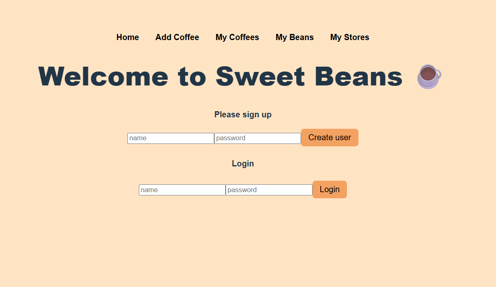
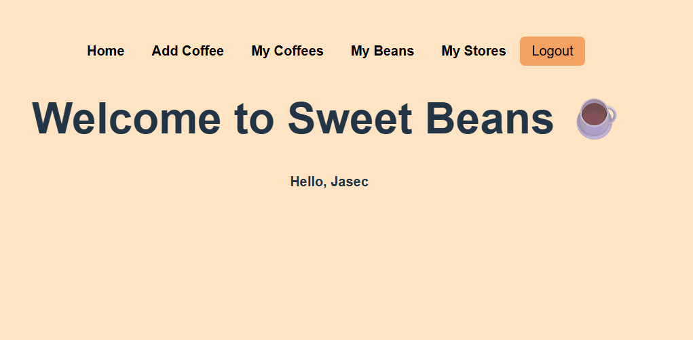
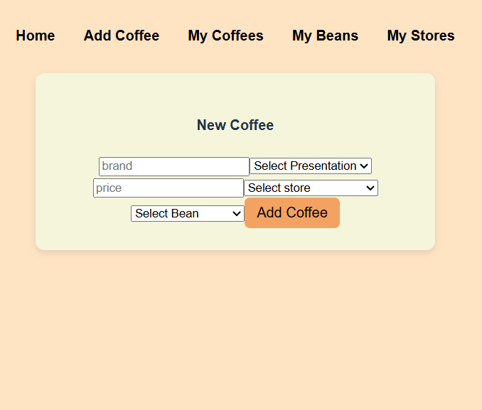
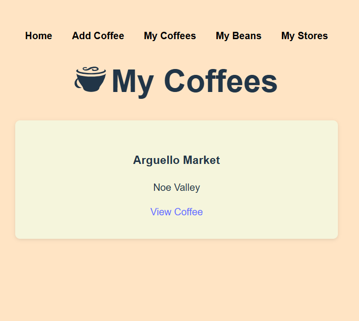
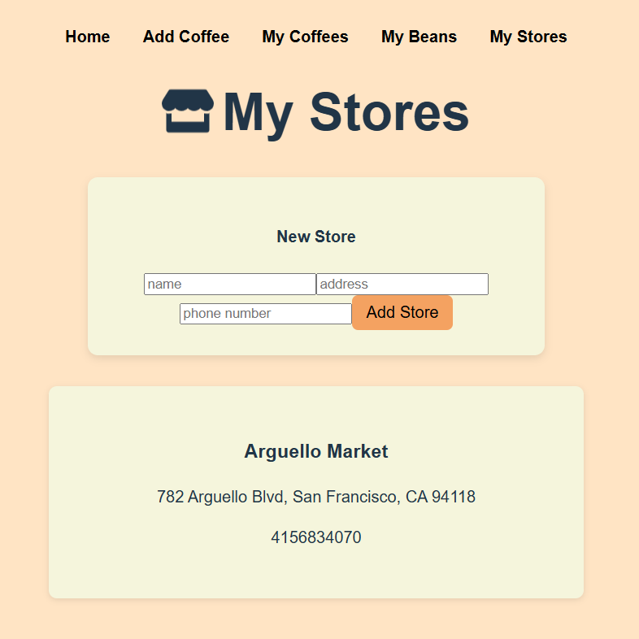
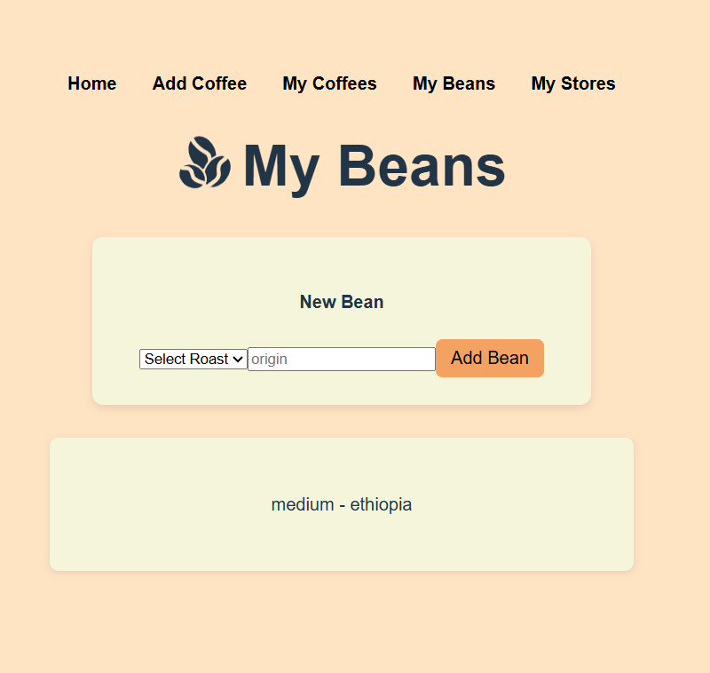
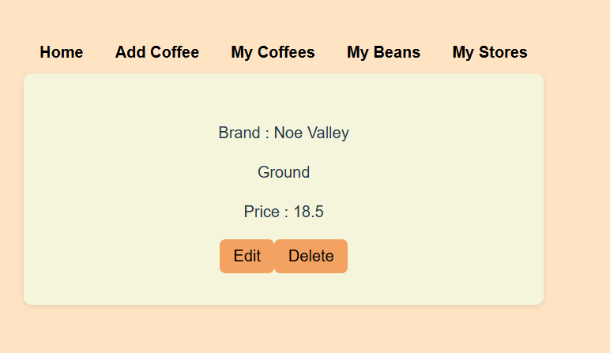

# Sweet Beans ☕
Sweet Beans is a full-stack web application that allows users to track coffee beans, stores, and the coffees they purchase.
Users can create beans and stores, then log coffees associated with them, edit coffee details, and remove entries as needed.

The application was built with a React frontend and a Flask backend, using SQLAlchemy and Marshmallow to manage relational data and validations.

## Screenshots
### Home

### Add Coffee

### My Coffees

### My Stores

### My Beans

### Coffee Details

## 🌟 Features

* User signup and login
* Session basec authentication
* Persisten login (user stays logged in after refresh)
* Logout functionality
* Create and manage coffee beans
* Create and manage stores
* Log coffees associated with specific beans and stores
* Edit coffee information
* Delete coffee entries
* Smooth navigation with React Router
* Form handling with Formik
* Form validation using Yup
* Backend validation using Flask-Marshmallow

## Technologies Used
## Frontend
* React
* React Router
* Yup
* CSS
* React Icons
* Backend
* Python
* Flask
* Flask-RESTful
* Flask-Marshmallow
* SQLAlchemy

## Database
* PostgreSQL (production)
* SQLite (local development)

## Backend
* Python
* Flask
* Flask-RESTful
* Flask-Marshmallow
* SQLAlchemy
* Database
* PostgreSQL (production)
* SQLite (local development)

## Tools
* Git
* GitHub

## Setup / Installation
git clone git@github.com:Jasec7/Sweet-Beans.git
### Backend
1. Navigate to the server directory
2. Install dependencies:
pipenv install
pipenv shell
3. Run the Flask server:
python app.py
(uses SQLite for local development)

### Frontend
1. Navigate to the client directory
2. Install dependencies:
npm install
3. Start the app:
npm run dev

## API Endpoints
* /users
* /stores
* /beans
* /coffees
* /coffees/:id

## 🚀 Deployment
For development and presentation purposes, the application run locally using:

* python app.py for the backend
* npm start for the frontend

Environment variables are used to differentiate between local and production configurations.

## 📝License
This project is licensed under the MIT License.

## Contributors
* Jasec7
